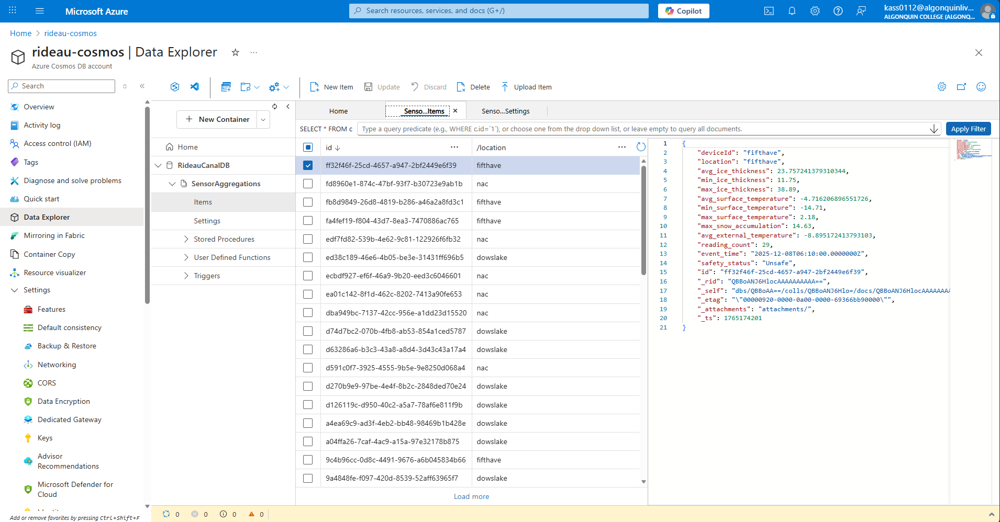

### 1. Project Title and Description

Rideau Canal Ice Monitoring & Safety Analytics System

A cloud-based real-time monitoring platform that collects ice thickness, temperature, and snow accumulation data from simulated IoT sensors along the Rideau Canal. The system processes the data in Azure Stream Analytics, stores it in Cosmos DB and Blob Storage, and visualizes safety conditions on a live dashboard.

### 2. Student Information

- **Anani Thierry Kassa**
- **041140713**
- Links to all three repositories

Main Documentation: https://github.com/AnaniKassa/rideau-canal-monitoring

Sensor Simulation: https://github.com/AnaniKassa/rideau-canal-sensor-simulation

Web Dashboard: https://github.com/AnaniKassa/rideau-canal-dashboard

### 3. Scenario Overview
- Problem Statement

The Rideau Canal Skateway requires continuous monitoring of ice conditions to keep the public safe. Manual checks are slow, inconsistent, and cannot provide real-time visibility.

- System Objectives

Collect real-time sensor data on ice thickness and temperature

Process and analyze data using Azure Stream Analytics

Determine safety status using automated rules

Provide a real-time dashboard for public and operations staff

Store raw and aggregated data for historical analysis

### 4. System Architecture
- Architecture Diagram
```
IoT Sensors (Simulated) → Azure IoT Hub → Azure Stream Analytics
                                                    ↓
                                          ┌─────────┴─────────┐
                                          ↓                   ↓
                                   Azure Cosmos DB    Azure Blob Storage
                                          ↓
                                   Web Dashboard
                                (Azure App Service)
```

- Data Flow Explanation

Sensors generate telemetry every 5 minutes

IoT Hub receives and queues device messages

Stream Analytics processes data:

Computes averages, min/max

Calculates safety status

Writes aggregated data to Cosmos DB

Writes raw events to Blob Storage

Web dashboard fetches data from API and visualizes trends

- Azure Services Used

Azure IoT Hub

Azure Stream Analytics

Azure Cosmos DB

Azure Blob Storage

Azure App Service

### 5. Implementation Overview
- IoT Sensor Simulation

Generates random-but-realistic telemetry for:

ice_thickness

surface_temperature

external_temperature

snow_accumulation

Repo: https://github.com/AnaniKassa/rideau-canal-sensor-simulation

- Azure IoT Hub Configuration

Device registration: dowslake, fifthave, nac

SAS connection string used in simulator

- Stream Analytics Job (with Query)

```
-- RAW EVENTS TO BLOB
SELECT
    IoTHub.ConnectionDeviceId AS deviceId,
    timestamp,
    location,
    ice_thickness,
    surface_temperature,
    snow_accumulation,
    external_temperature
INTO
    [historical-data]
FROM
    [rideau-iothub];

-- AGGREGATIONS TO COSMOS DB
SELECT
    IoTHub.ConnectionDeviceId AS deviceId,
    location,
    AVG(ice_thickness) AS avg_ice_thickness,
    MIN(ice_thickness) AS min_ice_thickness,
    MAX(ice_thickness) AS max_ice_thickness,
    AVG(surface_temperature) AS avg_surface_temperature,
    MIN(surface_temperature) AS min_surface_temperature,
    MAX(surface_temperature) AS max_surface_temperature,
    MAX(snow_accumulation) AS max_snow_accumulation,
    AVG(external_temperature) AS avg_external_temperature,
    COUNT(*) AS reading_count,
    System.Timestamp AS event_time,
    CASE
        WHEN AVG(ice_thickness) >= 30 AND AVG(surface_temperature) <= -2 THEN 'Safe'
        WHEN AVG(ice_thickness) >= 25 AND AVG(surface_temperature) <= 0 THEN 'Caution'
        ELSE 'Unsafe'
    END AS safety_status
INTO
    [SensorAggregations]
FROM
    [rideau-iothub]
GROUP BY
    IoTHub.ConnectionDeviceId,
    location,
    TumblingWindow(second, 300);
```
- Cosmos DB Setup

Database: RideauCanalDB

Container: SensorAggregations

Partition key: /location

Document ID: {location}-{timestamp}

- Blob Storage

Used to store raw telemetry under:
/dailyfiles/YYYY/MM/DD/

- Web Dashboard

Frontend + backend Node.js app:
https://github.com/AnaniKassa/rideau-canal-dashboard

- Azure App Service Deployment

Node.js App Service hosting the dashboard backend and UI.

### 6. Repository Links

- Sensor Simulation: https://github.com/AnaniKassa/rideau-canal-sensor-simulation

- Dashboard Application: https://github.com/AnaniKassa/rideau-canal-dashboard

- Live Dashboard: [Insert Web App URL]

### 7. Video Demonstration

📹 Video Demo: https://youtu.be/aaTC0jzQBh8

### 8. Setup Instructions
- Prerequisites

Azure account

Node.js

Python (used for the simulation)

Stream Analytics permissions

- High-Level Steps

```
sequenceDiagram
    participant Dev as Developer
    participant IoT as IoT Hub
    participant SA as Stream Analytics
    participant DB as Cosmos DB
    participant Web as App Service

    Dev->>IoT: Deploy Sensor Simulation
    IoT->>SA: Send device telemetry
    SA->>DB: Store aggregated metrics
    SA->>Blob: Store raw data
    Web->>DB: Fetch latest data
    Dev->>Web: Deploy dashboard to App Service
```

- Detailed Setup

See each component repository for full instructions:

Sensor simulation: instructions inside its repo

Dashboard setup: installation + .env instructions in dashboard repo

### 9. Results and Analysis
- Sample Cosmos DB Output


- Observations

5-minute tumbling window produces smooth trends

Safety status updates in real time

Dashboard accurately visualizes ice, snow, and temperature

- Performance

Stream Analytics processed messages with low latency

App Service serves data quickly after indexing

### 10. Challenges and Solutions
Challenge	Solution
Stream Analytics Timestamp conversion errors	Removed unsupported CONVERT() and normalized time in server
Some dashboard metrics not loading	Fixed API queries to normalize location names
Cosmos DB partition key confusion	Ensured /location used consistently
Web dashboard failed to fetch data	Updated server routing + CORS configuration

### 11. AI Tools Disclosure

ChatGPT (GPT-5.1) was used for:

Debugging Stream Analytics SQL

Improving documentation and README writing

Helping design architecture diagrams

All code and deployments were implemented by myself.

### 12. References

25F_CST8916_300 Remote Data and RT Applications course content: https://brightspace.algonquincollege.com/d2l/home/825152

Azure IoT Hub device SDK: https://learn.microsoft.com/fr-fr/azure/iot-hub/

Azure Stream Analytics SQL Reference: https://learn.microsoft.com/fr-fr/azure/stream-analytics/

Azure Cosmos DB SQL API docs: https://learn.microsoft.com/fr-fr/azure/cosmos-db/

Chart.js for dashboard visualization: https://www.chartjs.org/docs/latest/

Node.js & Express.js guides: https://nodejs.org/docs/latest/api/ and https://expressjs.com/